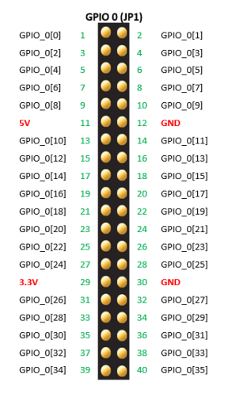
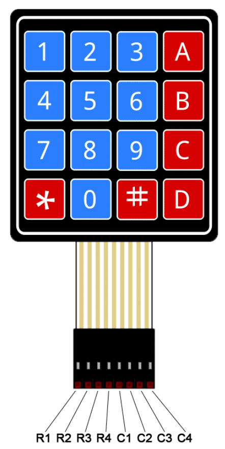

# Setting Up and Running the Hardware 

To set up the hardware, wire all external devices [devices](#devices)
to the DE1-SoC as [specified](#wiring). Then, on an Android phone, turn on data
and enable a WiFi hotspot. Enter the hotspot's SSID and password at the top of 
the function esp8266_init1(...) in [esp8266.c](software/embedded_software/esp8266.c).
Finally, as usual, open Eclipse from Quartus, program the DE1-SoC's FPGA, build 
the embedded_software project, and run it as Nios II hardware.

## Devices
The following hardware modules are connected to the DE1-SoC via its GPIO ports:
- 4x4 membrane keypad
- SG90 9g Micro Servo
- Terasic RFS Daughtercard

## Wiring
- [4x4 membrane keypad pinout](#4x4-membrane-keypad-pinout)
- [DE1-SoC's JP1 GPIO Expansion Port](#de1-socs-jp1-gpio-expansion-port)

4x4 membrane keypad's connections to the DE1-SoC (DE1-SoC JP1 port pin: keypad connection):

- GPIO_0[10]: R1     
- GPIO_0[12]: R2 
- GPIO_0[14]: R3  
- GPIO_0[16]: R4  
- GPIO_0[18]: C1 
- GPIO_0[20]: C2 
- GPIO_0[22]: C3 
- GPIO_0[24]: C4 

SG90 9g Micro Servo's connections to the DE1-SoC:

- GPIO_0[8]: 5v (red wire)
- GPIO_0[9]: GND (brown wire)
- GPIO_0[7]: PWM (orange wire)

Terasic RFS Daughtercard's connection to the DE1-SoC:

- Plug into JP2 GPIO expansion header of DE1-SoC.

# DE1-SoC's JP1 GPIO Expansion Port

# 4x4 membrane keypad pinout

